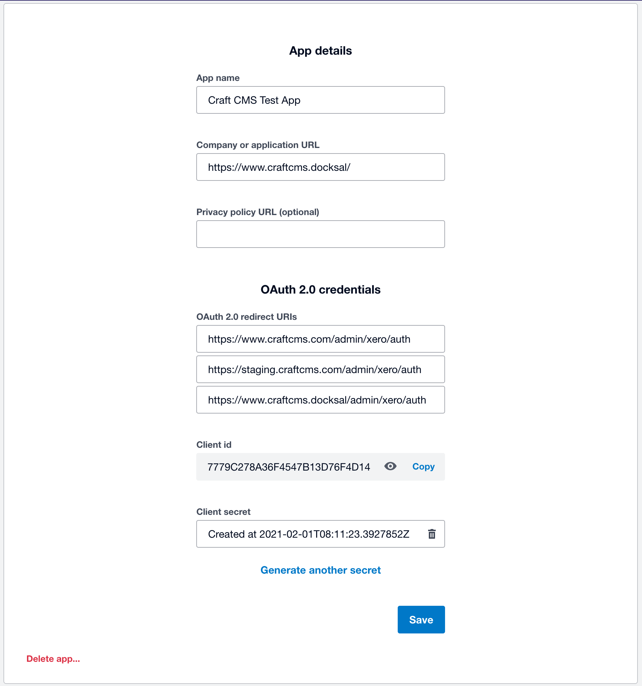
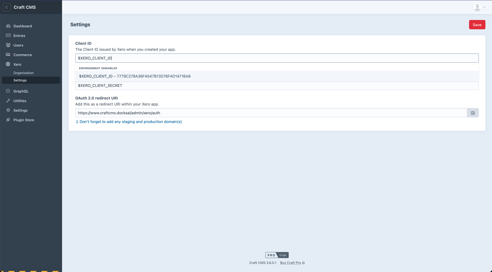
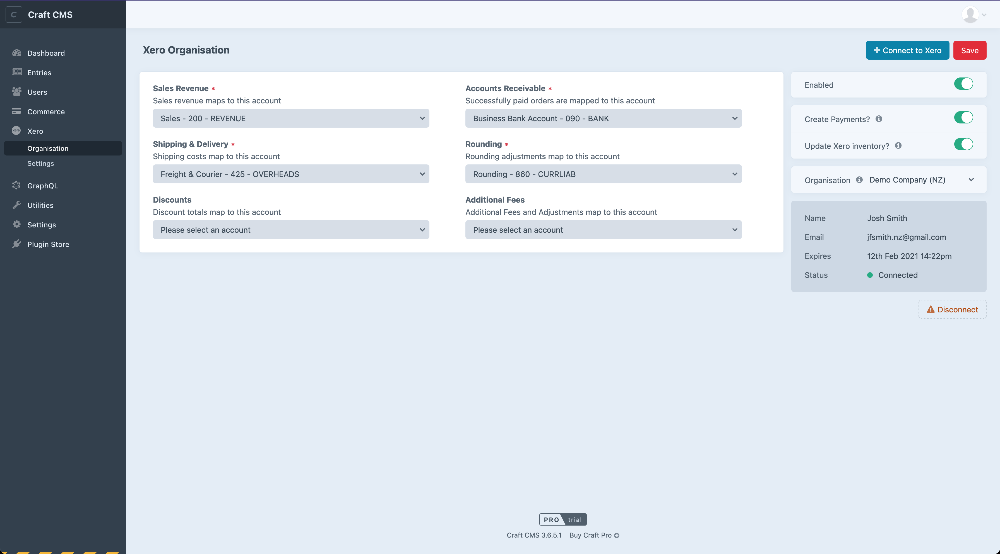

# Xero plugin for Craft Commerce 2 & 3

## Overview
This plugin allows you to automatically send Commerce invoices into Xero including contacts, payments and even inventory updates.

### Installation
`composer require thejoshsmith/craft-commerce-xero`

### Getting Started
You'll need to sign up for a free Xero account and add a OAuth 2.0 Xero App. You can view Xero's <a href="https://developer.xero.com/documentation/getting-started/getting-started-guide">getting started guide here</a>.

Once the plugin is installed, you need to configure the Xero app connection settings from the `Settings` nav item. Simply enter the Client ID and Secret from your Xero app and click save.

> Note: It's recommended to set the Client ID and Secret to environment variables in your .env file

Finally, the OAuth callback URL needs to be added to your Xero app including any staging or production domains.

### Connecting an Organisation
From the Organisations nav item, click the "Connect to Xero" button to intiate a connection to Xero.

As Xero is now a multi-tenated system, you can link multiple organisations and choose between them from the drop down menu.

You can connect additional organisations using the "Connect to Xero" button and disconnect the current organisation using the "Disconnect" button at the bottom.

Changing the current organisation using the drop down will automatically reload the page with the relevant settings.

> Note: Only the currently selected organisation will be synced with Commerce

### Organisation Settings
Once an organisation is connected the plugin allows you to map your Chart of Accounts (Account Codes) including:

- sales revenue
- accounts receivable
- shipping/develiery
- rounding

By default all fully paid orders will be pushed into the queue (you'll need to ensure you're processing the queue freqeuently) with a delay of 30 seconds (this is reduce the time customers spend waiting for their order to process) and then once the queue has dispatched the job, the invoice will be sent to Xero.

If you need to send existing orders to Cero you can do so by viewing an order and you'll see a "Send to Xero" button which will instantly send the order off to Xero. This button also currently acts as a way to see if an order is already in Xero.

### What fields are sent to Xero
Below is a list of fields that is sent to Xero. In future versions hooks/events will be avaialbe if you require more information to be sent.

**Contact**
- first name
- last name
- email

**Order**
- status (AUTHORISED)
- type (ACCREC)
- contact (as above)
- LineAmountType (Exclusive) (future versions will be configurable)
- Invoice Number (order referrence)
- SentToContact (invoices are marked as sent)
- Due Date (now)

**Line Items**
- account code (sales)
- description (product tile)
- quantity
- unit amount (item total)
- Item Code (sku) (if inventory is enabled)

**Shipping adjustments**
- same as above but account is set to you defined shipping account.

**Payment**
- account (receivable account)
- reference (order transaction reference)
- amount (total paid amount)
- date (date paid)

### Rounding
Due to how different systems calculate rounding if for whatever reason the order total is different to what Xero calculates, an additional line item to account for rounding is added in Xero. Please ensure you have this account code selected under settings.

> More detailed documentation coming soon

## Feature requests 🙏
As this plugin is still in active development now is a good time to suggest new features. Feel free to contact me via email or create a GitHub issue.

## Roadmap 🚀
- Improve documentation
- Configure Crafts new testing framework to ensure new features don't cause unexpected issues.
- Add multiple hooks/events so developers can further extend if required
- Refunds support
- Admin features like element actions, widgets and different syncing methods

## Requirements
This plugin requires Craft CMS 3.1.0 or later and Craft Commerce 2.0 & 3.0 or later.
